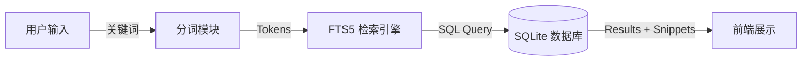

# Electron AI Browser 项目功能与架构概览

本文档旨在全面介绍 Electron AI Browser 的项目定位、核心功能以及技术架构。本项目致力于打造一个统一的 AI 对话管理平台，让用户能够在一个应用中高效地使用和管理多个 AI 服务（如 ChatGPT, Copilot 等）。
## 实现成果截图

|  |  |
|  |  |

## 一、 实验背景与目的
## 1. 项目愿景与核心价值

**Electron AI Browser** 是一个集成了多款主流 AI 聊天服务的桌面浏览器应用。它的核心价值在于：

*   **统一入口**: 用户无需在浏览器标签页之间频繁切换，即可在一个应用内访问所有 AI 助手。
*   **数据私有化**: 所有的聊天记录都会被自动捕获并存储在本地数据库中，确保用户对数据的完全掌控。
*   **全局搜索**: 提供强大的垂直搜索引擎，支持对历史对话进行深度全文检索，解决“聊过但找不到”的痛点。

## 2. 核心功能模块

### 2.1 多平台集成 (Multi-Platform Integration)
应用通过嵌入式浏览器 (`BrowserView` / `Webview`) 加载第三方 AI 网站。
*   **支持平台**: 目前已支持 ChatGPT, Copilot 等主流服务。
*   **独立会话**: 每个平台运行在独立的沙箱环境中，互不干扰。

### 2.2 自动化数据采集 (Automated Data Capture)
项目实现了一套非侵入式的数据采集机制，能够实时保存用户的对话内容。
*   **注入脚本 (Injector)**: 在加载 AI 网站时自动注入 `injector.js` 脚本。
*   **DOM 监听**: 脚本监听网页 DOM 变化，智能解析出用户发送的消息和 AI 的回复。
*   **实时同步**: 捕获的数据通过 Electron IPC 通道实时传输到主进程并存入数据库。

### 2.3 本地知识库与存储 (Local Storage)
所有数据均存储在用户本地的 SQLite 数据库中。
*   **结构化存储**: 聊天记录被解析为 `Conversation` (会话) 和 `Message` (消息) 两个核心实体。
*   **隐私安全**: 数据不上云，完全保存在本地文件系统。

### 2.4 垂直搜索引擎 (Vertical Search Engine)
这是项目的核心亮点功能，专为 AI 聊天记录设计的深度搜索引擎。
*   **中文分词**: 集成 `semgent` 分词引擎，对中文内容进行语义切分（例如将“垂直搜索引擎”切分为“垂直”、“搜索”、“引擎”），大幅提高搜索召回率。
*   **全文检索 (FTS5)**: 利用 SQLite 的 FTS5 扩展模块建立倒排索引，支持毫秒级的快速检索。
*   **高级过滤**: 支持按平台、时间范围、发送者（User/AI）进行多维度筛选。
*   **关键词高亮**: 搜索结果会自动高亮匹配的关键词，方便用户快速定位上下文。

## 3. 技术架构与数据流 (Architecture & Data Flow)

项目基于 Electron + React 技术栈构建，采用经典的主进程-渲染进程架构。

### 3.1 数据流向
1.  **采集端 (Renderer)**: 用户在 Webview 中聊天 -> 注入脚本解析 DOM -> 生成消息对象。
2.  **传输层 (IPC Bridge)**: 渲染进程通过 `contextBridge` 安全地调用主进程 API (`storage:save-conversation`)。
3.  **处理层 (Main Process)**: 主进程接收数据 -> 调用数据库服务。
4.  **存储层 (SQLite)**:
    *   **原始数据**: 存入 `messages_v2` 表。
    *   **索引数据**: 触发分词器，将清洗后的文本存入 `messages_fts_index` 索引表。
5.  **反馈层 (UI)**: 存储完成后通知前端更新 UI，展示最新的对话列表。

### 3.2 关键数据结构
*   **Conversation**: 包含 `id`, `platform`, `title` 等元数据。
*   **Message**: 包含 `content`, `sender` ('user'/'AI'), `thinking` (AI 思考过程) 等详情。

### 3.3 搜索流程

## 4. 总结

Electron AI Browser 不仅仅是一个套壳浏览器，它通过**自动化数据捕获**和**本地垂直搜索**两大核心技术，将分散在各个网页中的 AI 对话转化为用户可管理、可检索的个人知识库。
